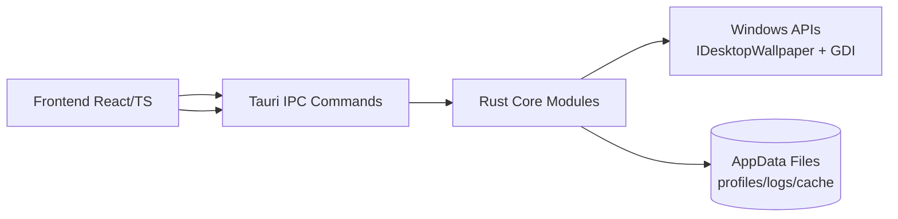
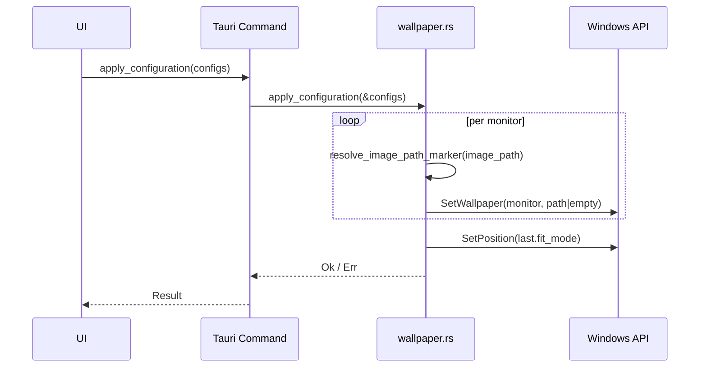

# Project Architecture

## Overview

The project uses a hybrid desktop architecture:

- **Frontend (WebView/Tauri)**: `src/`
- **Native backend (Rust/Tauri Commands)**: `src-tauri/src/`
- **Windows integration**: COM API (`IDesktopWallpaper`) + GDI

## High-Level Diagram

## Backend Modules

- `main.rs`
  - Registers Tauri commands
  - Orchestrates module calls
- `wallpaper.rs`
  - Monitor detection
  - Wallpaper/fit application
  - Marker resolution (`__NONE__`, `__SOLID__:#RRGGBB`)
- `profiles.rs`
  - JSON profile persistence
- `logger.rs`
  - Backend/frontend event logging to file

## Configuration Application Flow

## Persistence

- Profiles: `%APPDATA%/WallpaperManager/profiles/*.json`
- Logs: `%APPDATA%/WallpaperManager/logs/app.log`
- Solid color cache: `%APPDATA%/WallpaperManager/cache/solid_*.bmp`
