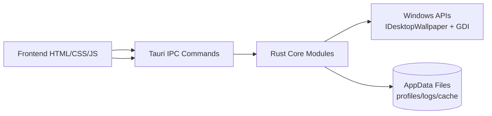
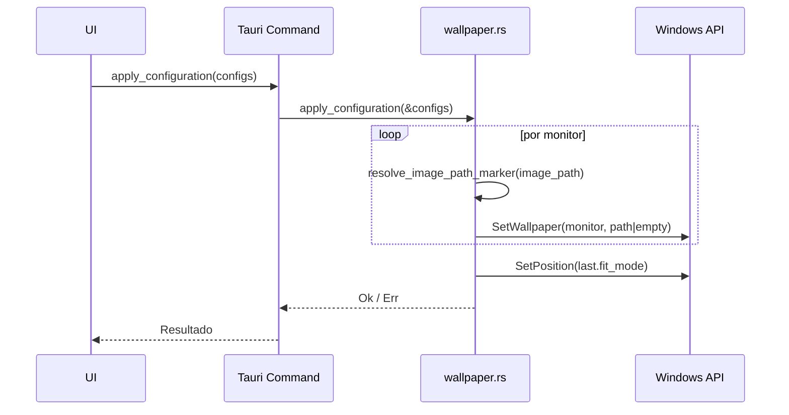

# Arquitectura del Proyecto

## Vista general

El proyecto usa una arquitectura de escritorio híbrida:

- **Frontend (WebView/Tauri)**: `src/`
- **Backend nativo (Rust/Tauri Commands)**: `src-tauri/src/`
- **Integración Windows**: COM API (`IDesktopWallpaper`) + GDI

## Diagrama de alto nivel

## Módulos backend

- `main.rs`
  - Registra comandos Tauri
  - Orquesta llamadas a módulos
- `wallpaper.rs`
  - Detección de monitores
  - Aplicación de wallpaper/fit
  - Resolución de markers (`__NONE__`, `__SOLID__:#RRGGBB`)
- `profiles.rs`
  - Persistencia de perfiles JSON
- `logger.rs`
  - Registro de eventos backend/frontend en archivo

## Flujo de aplicación de configuración

## Persistencia

- Perfiles: `%APPDATA%/WallpaperManager/profiles/*.json`
- Logs: `%APPDATA%/WallpaperManager/logs/app.log`
- Cache color sólido: `%APPDATA%/WallpaperManager/cache/solid_*.bmp`
